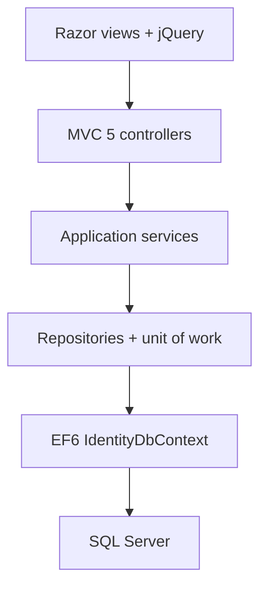
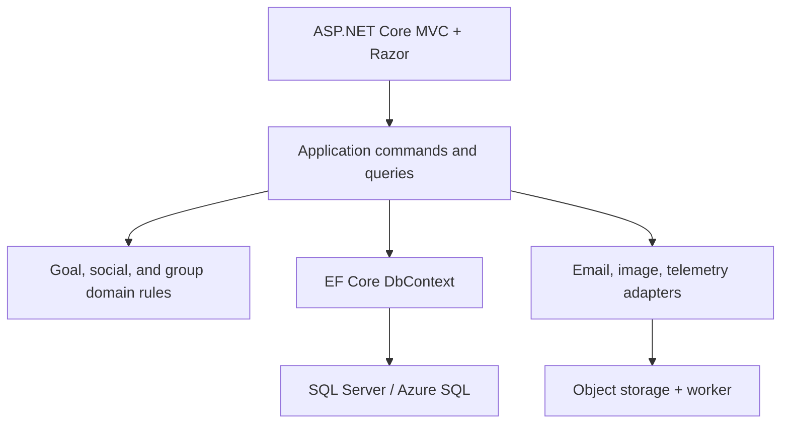

# SocialGoal modernization assessment

**Repository:** [`MarlabsInc/SocialGoal`](https://github.com/MarlabsInc/SocialGoal)  
**Repository revision assessed:** [`42cfdb48c5a450793c19c0503ea0ce786eb8e46a`](https://github.com/MarlabsInc/SocialGoal/commit/42cfdb48c5a450793c19c0503ea0ce786eb8e46a)  
**Assessment date:** July 22, 2026  
**Recommended destination:** ASP.NET Core MVC on .NET 10 LTS, EF Core 10, ASP.NET Core Identity, SQL Server/Azure SQL, server-rendered Razor with modern progressive enhancement, and Linux containers after replacing `System.Drawing`.

## Executive conclusion

SocialGoal is not a Microsoft-developed product. It is a Marlabs reference application built in 2013–2014 to demonstrate the Microsoft web stack of that period. The repository is now effectively abandoned: the last commit was June 9, 2014. It targets .NET Framework 4.5, whose support ended January 12, 2016, and depends on first-generation or prerelease versions of ASP.NET MVC 5, ASP.NET Identity, OWIN, EF6, AutoMapper, Autofac, jQuery, Bootstrap, and related libraries.

The application can be modernized, but this is **not an in-place package update**. `System.Web`, the MVC 5 pipeline, OWIN/Katana authentication, ASP.NET Identity 1, EF6 conventions, `packages.config`, `Web.config`, filesystem image storage, server-side `System.Drawing`, ASP.NET bundling, and large amounts of jQuery-oriented UI code must either be replaced or isolated during an incremental transition.

The most important finding is that framework age is not the biggest risk. The repository contains high-confidence application-security and data-safety defects that a mechanical port could preserve:

1. **Object-level authorization is frequently missing.** An authenticated user can submit IDs belonging to another user or group to edit or delete goals, groups, updates, members, profiles, requests, and relationships. The controllers often check only that the caller is logged in, not that the caller owns the object or has the required group role.
2. **Many state changes use GET requests.** Examples include deleting a group member, following/unfollowing users, accepting/rejecting requests, supporting a goal, and joining a group. These operations are vulnerable to cross-site request forgery, link prefetching, crawlers, and accidental replay.
3. **Profile-image URL import is an SSRF and denial-of-service path.** The server fetches an arbitrary user-supplied URL without an allowlist, private-address filtering, a timeout, a redirect policy, or response/decoded-image size limits.
4. **The application registers `DropCreateDatabaseIfModelChanges`.** A model mismatch can trigger database recreation and data loss.
5. **ELMAH is configured without authentication and debug compilation is enabled.** If deployed as committed, exception details and sensitive diagnostics may be publicly exposed.
6. **Authentication and identity migration is a data migration, not a middleware swap.** User IDs, password hashes, external-login keys, roles, cookies, and the combined Identity/domain schema need an explicit compatibility plan.

**Overall modernization risk: High.**  
**Feasibility: Good, provided the old application is treated as a behavioral reference rather than a trustworthy design.**  
**Recommended delivery model:** controlled reimplementation if there are no live users/data; incremental strangler migration if a live system or production database must remain available.

## Scope and method

This assessment examined the complete repository at the revision above, including:

- all seven Visual Studio projects and the solution file;
- all C# source, Razor views, JavaScript/CSS assets, project files, NuGet manifests, and configuration files;
- domain entities, EF6 mappings, repositories, services, controllers, authentication, email, image handling, tests, and bootstrapping;
- repository history and operational artifacts such as CI, containers, deployment configuration, migrations, and secrets handling;
- current Microsoft migration guidance and relevant public security advisories.

This was a static source review. No production database, runtime environment, user population, traffic data, deployment pipeline, or external service credentials were available. Therefore, database compatibility, actual password-hash behavior, external provider behavior, data volume, performance, and production-only configuration remain discovery items.

## Repository inventory

| Item | Observed |
|---|---:|
| Last commit | June 9, 2014 |
| Projects | 7 |
| Target framework | .NET Framework 4.5 in every project |
| C# files / lines | 219 / approximately 17,325 |
| Razor views / lines | 94 / approximately 8,057 |
| JavaScript files / lines | 58 / approximately 92,187, mostly vendored libraries |
| CSS files / lines | 44 / approximately 10,887, mostly vendored libraries and themes |
| MVC controllers | 7 |
| Domain-model files | 30 |
| EF configuration files | 25 |
| Repository classes | 25 |
| Service classes | 25 |
| Test files / test methods / assertions | 6 / 111 / 221 |
| CI workflows | None |
| Container definitions | None |
| EF migrations | None |
| Tracked binary/image/document assets | 103 |

The solution is a conventional layered monolith:

The layering is understandable, but it is more ceremony than protection. Authorization is not centralized, repository methods return materialized collections, controllers contain significant orchestration, and services often operate on caller-supplied IDs without a tenant/owner boundary.

## Current technology baseline

The README explicitly describes an ASP.NET MVC 5 / EF6 teaching application intended for Visual Studio 2013. Every project targets .NET Framework 4.5. Microsoft states that support for .NET Framework 4.5 ended January 12, 2016. See [Microsoft's .NET Framework lifecycle FAQ](https://learn.microsoft.com/en-us/lifecycle/faq/dotnet-framework).

The web application references, among others:

| Area | Current component | Modern disposition |
|---|---|---|
| Runtime | .NET Framework 4.5 | Replace with .NET 10 LTS |
| Web | ASP.NET MVC 5.0 / `System.Web` | Replace with ASP.NET Core MVC |
| Auth | ASP.NET Identity 1.0 + OWIN 2.0 | Migrate to ASP.NET Core Identity and cookie auth |
| ORM | EF 6.0.x, including `6.0.2-beta1` in web | Move first to supported EF6 if needed, then EF Core 10 |
| DI | Autofac 3.1.5 | Prefer built-in .NET DI; keep Autofac only for a demonstrated need |
| Mapping | AutoMapper 3.1.1 CI build and static API | Replace with explicit mapping or current AutoMapper profiles |
| Serialization | Newtonsoft.Json 5.0.6 | Prefer `System.Text.Json`; keep Newtonsoft only for compatibility |
| UI | Bootstrap 3 package, but bundles contain older Bootstrap 2-style scripts/CSS | Rebuild UI on Bootstrap 5 or another current design system |
| Browser code | jQuery 1.7.2 at runtime; jQuery UI 1.8; Handlebars 1.0 RC; jqPlot beta | Replace rather than port |
| Bundling | `System.Web.Optimization` / WebGrease | Use ASP.NET static web assets plus a minimal modern build tool if needed |
| Email | MvcMailer 4.5 + `System.Net.Mail` config | Replace with an email abstraction and supported provider SDK/SMTP client |
| Images | `System.Drawing`, local web-root files | Replace with ImageSharp/SkiaSharp and object storage |
| Logging | ELMAH 1.2.2 / Elmah.MVC 2.1.1 | Structured logging, OpenTelemetry, centralized error monitoring |
| Tests | NUnit 2.6.3 + Moq 4.1 | Current NUnit/xUnit and modern integration tests |

The package manifest confirms the age and prerelease dependencies ([`packages.config`, lines 3–39](https://github.com/MarlabsInc/SocialGoal/blob/42cfdb48c5a450793c19c0503ea0ce786eb8e46a/source/SocialGoal/packages.config#L3-L39)). The bundle configuration actually loads jQuery 1.7.2 and two jQuery UI versions in the same bundles ([`BundleConfig.cs`, lines 15–42](https://github.com/MarlabsInc/SocialGoal/blob/42cfdb48c5a450793c19c0503ea0ce786eb8e46a/source/SocialGoal/App_Start/BundleConfig.cs#L15-L42)).

Known reviewed advisories directly affect committed frontend versions:

- jQuery 1.7.2 falls within the affected ranges for [CVE-2015-9251](https://github.com/advisories/GHSA-rmxg-73gg-4p98) and [CVE-2020-11023](https://github.com/advisories/GHSA-jpcq-cgw6-v4j6).
- Bootstrap 3.0.0 falls within the affected range for [CVE-2019-8331](https://github.com/advisories/GHSA-9v3m-8fp8-mj99).

Those examples are not a complete software-composition analysis. A full restore plus SCA/SBOM scan is still required because several libraries are vendored as raw JavaScript rather than represented accurately in NuGet metadata.

## Functional surface that must be preserved or deliberately retired

The existing code supports more than simple goal CRUD. A migration backlog should explicitly decide the disposition of each behavior:

- account registration, local password login, external login, account linking, and profile editing;
- profile-image upload, crop, URL import, replacement, and deletion;
- personal public/private goals, metrics, status, target values, updates, comments, supporters, invitations, search, pagination, and progress charts;
- user follow requests, accept/reject, followers, following, and notifications;
- groups, administrators/members, membership requests, invitations, focuses, group goals, assignees, group updates/comments/supporters, and reports;
- email invitation links and one-time security tokens;
- notification aggregation across goal, group, support, invitation, and follow activity.

The README's planned Web API and mobile backend were never implemented. There is no stable API contract to preserve, which reduces technical constraints but means a new API must be designed if mobile or third-party clients are now required.

## Critical security findings

### 1. Broken object-level authorization (critical)

The `[Authorize]` attribute on controllers proves only that the caller has an account. It does not prove that the caller owns a goal, administers a group, is the intended recipient of a follow request, or can edit a target profile.

High-confidence examples include:

- `EditProfile` trusts the posted `UserId`, loads that user, and updates it without comparing the ID with the authenticated user's ID ([`AccountController.cs`, lines 577–589](https://github.com/MarlabsInc/SocialGoal/blob/42cfdb48c5a450793c19c0503ea0ce786eb8e46a/source/SocialGoal/Controllers/AccountController.cs#L577-L589)).
- `AcceptRequest` trusts both user IDs supplied in the URL and creates the relationship without verifying that the logged-in user is the recipient ([lines 610–621](https://github.com/MarlabsInc/SocialGoal/blob/42cfdb48c5a450793c19c0503ea0ce786eb8e46a/source/SocialGoal/Controllers/AccountController.cs#L610-L621)).
- `DeleteMember` deletes any group membership identified by URL parameters and does not verify group-admin status ([`GroupController.cs`, lines 154–158](https://github.com/MarlabsInc/SocialGoal/blob/42cfdb48c5a450793c19c0503ea0ce786eb8e46a/source/SocialGoal/Controllers/GroupController.cs#L154-L158)).
- group edit/delete and group-goal edit/delete operations load by numeric ID and write/delete without an ownership or membership policy ([`GroupController.cs`, lines 300–330](https://github.com/MarlabsInc/SocialGoal/blob/42cfdb48c5a450793c19c0503ea0ce786eb8e46a/source/SocialGoal/Controllers/GroupController.cs#L300-L330), [lines 389–439](https://github.com/MarlabsInc/SocialGoal/blob/42cfdb48c5a450793c19c0503ea0ce786eb8e46a/source/SocialGoal/Controllers/GroupController.cs#L389-L439)).
- personal-goal edit and delete operations update by posted/requested ID without checking `Goal.UserId` against the current user ([`GoalController.cs`, lines 127–136](https://github.com/MarlabsInc/SocialGoal/blob/42cfdb48c5a450793c19c0503ea0ce786eb8e46a/source/SocialGoal/Controllers/GoalController.cs#L127-L136), [lines 172–181](https://github.com/MarlabsInc/SocialGoal/blob/42cfdb48c5a450793c19c0503ea0ce786eb8e46a/source/SocialGoal/Controllers/GoalController.cs#L172-L181)).

**Migration implication:** do not preserve controller/service signatures that accept a naked entity ID and assume authorization. Every command must load the object within an authorization-aware query or invoke a policy such as `CanEditGoal`, `IsGroupAdmin`, or `IsRequestRecipient`. Add negative integration tests for cross-user and cross-group access before moving features.

### 2. State-changing GET endpoints and incomplete CSRF protection (critical)

At least the following state changes are ordinary GET actions: logoff, delete group member, follow request, accept/reject request, unfollow, join/request group membership, accept/reject group request, support/unsupport goals, and support/unsupport updates. The code even comments out `[HttpPost]` and `[ValidateAntiForgeryToken]` on logoff ([`AccountController.cs`, lines 331–339](https://github.com/MarlabsInc/SocialGoal/blob/42cfdb48c5a450793c19c0503ea0ce786eb8e46a/source/SocialGoal/Controllers/AccountController.cs#L331-L339)).

Only seven controller actions explicitly validate an antiforgery token while 32 are marked POST. A custom POST filter provider exists in a separate project but is not registered in `FilterProviders.Providers` or the global filter collection; Autofac's `RegisterFilterProvider()` is not registration of that custom provider. Therefore, it should not be assumed to protect the remaining POSTs.

**Migration implication:** all mutations become POST/PUT/PATCH/DELETE commands, apply `AutoValidateAntiforgeryToken` to browser controllers, and add explicit authorization. Microsoft's current guidance explains that automatic antiforgery validation should apply to unsafe methods, while GET/HEAD/OPTIONS/TRACE remain safe ([ASP.NET Core antiforgery guidance](https://learn.microsoft.com/en-us/aspnet/core/security/anti-request-forgery?view=aspnetcore-10.0)).

### 3. SSRF and image-processing denial of service (critical)

`UploadImage` accepts a URL, passes it to `WebRequest.Create`, follows the response, copies the entire body into memory without a maximum, and decodes it as a bitmap ([`AccountController.cs`, lines 404–470](https://github.com/MarlabsInc/SocialGoal/blob/42cfdb48c5a450793c19c0503ea0ce786eb8e46a/source/SocialGoal/Controllers/AccountController.cs#L404-L470)). There is no restriction on scheme, hostname, resolved IP, redirects, content type, compressed size, decoded dimensions, timeout, or download duration.

Consequences include access to loopback/private/cloud-metadata endpoints, internal port probing, memory exhaustion, slow responses tying up worker threads, and image decompression bombs. OWASP specifically uses server-fetched profile-picture URLs as an SSRF example ([OWASP API Security SSRF scenario](https://owasp.org/API-Security/editions/2023/en/0xa7-server-side-request-forgery/)).

The local upload path also lacks explicit server-side file size, decoded pixel, and content-signature limits. Microsoft recommends server-side extension/content validation, safe generated filenames, upload size limits, and malware scanning ([ASP.NET Core file-upload guidance](https://learn.microsoft.com/en-us/aspnet/core/mvc/models/file-uploads?view=aspnetcore-10.0)).

**Migration implication:** preferably remove URL import. If retained, use an isolated fetch service with HTTP/HTTPS only, DNS/IP validation before and after redirects, private/link-local/loopback denial, short timeouts, bounded redirects, bounded streamed bytes, content sniffing, bounded decoded dimensions, rate limits, and egress controls. Store processed images in object storage, not the application filesystem.

### 4. Destructive database initializer (critical)

Application startup registers `GoalsSampleData` ([`Global.asax.cs`, lines 14–22](https://github.com/MarlabsInc/SocialGoal/blob/42cfdb48c5a450793c19c0503ea0ce786eb8e46a/source/SocialGoal/Global.asax.cs#L14-L22)). That initializer inherits `DropCreateDatabaseIfModelChanges` ([`GoalsSampleData.cs`, lines 11–35](https://github.com/MarlabsInc/SocialGoal/blob/42cfdb48c5a450793c19c0503ea0ce786eb8e46a/source/SocialGoal.Data/GoalsSampleData.cs#L11-L35)).

**Migration implication:** disable this immediately in any environment containing valuable data. Establish an immutable baseline schema from a database export, create reviewed EF Core migrations, and test forward and rollback procedures against production-like copies. Deployment identities should not have permission to drop production databases.

### 5. Diagnostic information exposure and insecure production defaults (high)

Committed `Web.config` enables the ELMAH handler for everyone, does not require authentication, permits all users/roles, and compiles with `debug="true"` ([`Web.config`, lines 19–40](https://github.com/MarlabsInc/SocialGoal/blob/42cfdb48c5a450793c19c0503ea0ce786eb8e46a/source/SocialGoal/Web.config#L19-L40)). Cookie security flags, HSTS, CSP, frame protection, and other modern security headers are not explicitly configured.

**Migration implication:** centralized error monitoring must never expose raw exception pages publicly. Use environment-specific configuration, secret stores, HTTPS-only secure cookies, HSTS, a practical CSP, `X-Content-Type-Options`, clickjacking protection, referrer policy, and appropriate cache controls.

### 6. Tokens and invitation flow lack lifecycle controls (high)

`SecurityToken` contains only an integer ID, GUID token, and target ID. It has no type, intended recipient, issuer, created/expiry time, use count, revoked state, or cryptographic protection. Invitations store raw GUIDs and delete them on use, but the design does not enforce expiry or bind the token to a recipient.

**Migration implication:** use ASP.NET Core Data Protection or a signed, purpose-bound token with explicit expiry and one-time redemption. Store only a hash where practical, include audit events, and distinguish group invites, goal support invites, email verification, and password reset purposes.

### 7. Dependency vulnerabilities and provenance (high)

Several runtime assets are vulnerable or unsupported. Some source files are not represented in package manifests, so normal dependency tools may miss them. The repository contains multiple jQuery versions from 1.2.6 through 1.10.2, two jQuery UI versions in the same bundle, beta jqPlot, Handlebars RC, old plugins, whole theme directories, and copied/minified libraries.

**Migration implication:** do not try to incrementally update this browser dependency graph. Replace it. Generate an SBOM from the new build, use lock files/central package management, Dependabot or equivalent, secret scanning, code scanning, and CI policy gates.

## Authentication and identity migration risks

The current context derives from `IdentityDbContext<ApplicationUser>` and mixes Identity tables with approximately two dozen domain sets in one EF6 context ([`SocialGoalEntities.cs`, lines 13–44](https://github.com/MarlabsInc/SocialGoal/blob/42cfdb48c5a450793c19c0503ea0ce786eb8e46a/source/SocialGoal.Data/SocialGoalEntities.cs#L13-L44)). `ApplicationUser` extends the original string-ID `IdentityUser` and adds duplicated email/profile fields, `RoleId`, and navigation properties.

Key risks:

- ASP.NET Identity 1 and ASP.NET Core Identity use different packages, schemas, stores, APIs, cookie formats, and defaults.
- Existing string user IDs are foreign keys throughout goals, follows, invitations, supports, comments, group memberships, and profiles. Changing the key type would multiply migration risk with no clear benefit; preserve string IDs unless a compelling requirement exists.
- Password hashes must be tested against real rows. A compatibility password hasher can verify legacy hashes and rehash on successful login, but this must be proved with representative users.
- Existing authentication cookies cannot simply be read by the new application. During a side-by-side migration, use remote authentication/System.Web adapters or an intentionally configured shared-cookie scheme.
- External login provider keys and callbacks require new registrations and redirect URLs. The old code calls parameterless `UseGoogleAuthentication()` ([`Startup.Auth.cs`, lines 11–35](https://github.com/MarlabsInc/SocialGoal/blob/42cfdb48c5a450793c19c0503ea0ce786eb8e46a/source/SocialGoal/App_Start/Startup.Auth.cs#L11-L35)); that integration should be considered nonfunctional until proved otherwise.
- There is no visible email confirmation, robust password-reset implementation, MFA, lockout configuration, or account recovery policy.
- `RoleId` is separate from the Identity role model and group admin is a boolean on membership. These authorization concepts must be normalized into policies without losing group-scoped permissions.

Microsoft documents remote authentication for incremental ASP.NET Framework-to-Core migrations ([authentication migration guidance](https://learn.microsoft.com/en-us/aspnet/core/migration/fx-to-core/areas/authentication?view=aspnetcore-10.0)). Use it only as a temporary bridge, not a permanent architecture.

## Data and EF migration risks

### Schema discovery is incomplete

There are no checked-in EF migrations or SQL DDL files. The schema appears to rely on Code First conventions and the destructive initializer. The actual database may have drifted from source. Before designing EF Core entities:

1. obtain a schema-only export and a sanitized data copy;
2. inventory tables, columns, types, indexes, constraints, defaults, nullability, cascades, orphan rows, duplicate rows, and row counts;
3. compare that database to the EF6 model;
4. freeze the baseline with a repeatable script and checksums.

### EF6 mappings do not translate mechanically

Microsoft explicitly states that EF6 Code First migrations are not compatible with EF Core migrations and recommends starting a fresh EF Core migration history while preserving the database/data ([porting EF6 to EF Core](https://learn.microsoft.com/en-us/ef/efcore-and-ef6/porting/)). This repository has no usable migration history anyway.

Particular issues include:

- extensive `virtual` navigation properties and implicit lazy loading;
- many unconstrained relationships and no obvious concurrency tokens;
- repository methods that materialize `IEnumerable<T>` early, causing in-memory filtering, repeated queries, and N+1 behavior;
- `DateTime.Now` throughout entities/view models instead of UTC or an injected clock;
- `double` for progress, targets, ZIP codes, and phone numbers; phone and postal values should be strings, and business measurements often require `decimal`;
- mixed naming and pluralization (`Support`, `GroupGoal`, `UserProfile`) that can produce different EF Core table conventions;
- application-side defaults such as `GoalStatusId = 1`, which assume seed ordering;
- potential missing unique indexes on relationship tables and invitation/support pairs;
- detached whole-entity updates (`Attach` then mark the entire entity modified), which amplify overposting and lost-update risk;
- missing transaction boundaries for multi-step operations such as group deletion plus membership deletion;
- no soft-delete, audit trail, row version, or idempotency design.

One mapping file defines `FirstName` as required with maximum length 1 and repeats conflicting email lengths, but `ApplicationUserConfiguration` is not added to `OnModelCreating` ([configuration file](https://github.com/MarlabsInc/SocialGoal/blob/42cfdb48c5a450793c19c0503ea0ce786eb8e46a/source/SocialGoal.Data/Configuration/ApplicationUserConfiguration.cs#L11-L18), [registered configurations](https://github.com/MarlabsInc/SocialGoal/blob/42cfdb48c5a450793c19c0503ea0ce786eb8e46a/source/SocialGoal.Data/SocialGoalEntities.cs#L57-L79)). This is evidence that the source model cannot be assumed to describe the deployed schema accurately.

### Data migration strategy

Use one of two patterns:

- **No live data:** create a clean EF Core schema, seed reference data using stable keys, and import only necessary sample/content data.
- **Live data:** map EF Core to the existing schema first, preserving table/column names and string user IDs. Deploy read-only comparison queries, then controlled write paths. Introduce schema improvements in later additive migrations. Never combine identity transformation, table renaming, key changes, and feature rewrite in one cutover.

Run reconciliation checks for row counts, relationship counts, orphan detection, password-login samples, external login mappings, invitation state, latest updates, and aggregate counts displayed in the UI.

## Web and frontend migration risks

The Razor syntax is superficially familiar, but ASP.NET MVC 5 views do not drop into ASP.NET Core unchanged. Differences include HTML helpers and Ajax helpers, bundling, child actions, partial rendering, request APIs, route APIs, session/TempData behavior, authentication claims, namespaces, and configuration.

The UI also contains a large amount of inline JavaScript distributed across layouts and feature views. Four overlapping bundles repeat nearly the same list of scripts, load old jQuery/jQuery UI, and rely on Bootstrap 2/3-era plugins, PJAX, jqModal, jqPlot, Jcrop, autocomplete, NiceScroll, and Handlebars RC. There are multiple copies of validation scripts and several whole legacy themes.

**Recommendation:** retain server-rendered MVC/Razor as the application model, but rebuild the presentation layer with semantic HTML, Bootstrap 5 (or another current design system), CSS variables, and small ES modules. Use native `fetch` and lightweight progressive enhancement. Replace jqPlot with a maintained chart library. Do not introduce React/Next.js unless there is a product requirement for a rich client application; a SPA would add API, state, auth, validation, accessibility, and deployment scope without solving the migration's hardest risks.

Accessibility and responsive behavior should be treated as new acceptance criteria. The old app predates modern WCAG expectations, uses old responsive CSS, and was reportedly tested primarily in Chrome.

## Image and file-storage migration risks

The application writes profile images into `Content/ProfilePics` and deletes the previous file from the local web root. This fails under common modern deployment models:

- container filesystems are ephemeral;
- multiple instances do not share local files;
- deployment replacement may discard uploads;
- web-root write permissions enlarge the blast radius;
- backups, retention, scanning, and CDN delivery are undefined.

`System.Drawing.Common` is Windows-only in modern .NET, and the non-Windows compatibility switch was removed in .NET 7 ([Microsoft compatibility note](https://learn.microsoft.com/en-us/dotnet/core/compatibility/core-libraries/7.0/system-drawing)). To run on Linux, replace it with ImageSharp, SkiaSharp, or a dedicated image service.

Recommended flow: stream into bounded temporary storage, validate signature/type/size/dimensions, decode with resource limits, normalize/re-encode, scan, write to versioned object storage, update the database only after successful upload, and delete old objects asynchronously after a safe retention window.

## Testing and quality risks

The repository contains a nontrivial test suite—111 NUnit test methods and 221 assertions—but its protective value is limited:

- tests cover six controllers only;
- they are heavily mock-based and coupled to MVC 5 types, repositories, and implementation details;
- there are no database integration tests, browser tests, HTTP-level tests, schema-migration tests, security tests, load tests, accessibility tests, or deployment smoke tests;
- critical negative authorization cases are absent;
- test dependencies are themselves obsolete;
- there is no CI configuration, coverage report, deterministic build definition, or supported toolchain declaration.

The tests are useful for mining intended behavior, not as proof that a port is correct. Before feature migration, create characterization tests around HTTP outcomes and a disposable SQL Server database. The highest-value matrix is actor × action × object ownership, including owner, unrelated user, group member, group admin, invitation recipient, and anonymous user.

Minimum modern test pyramid:

- domain and application-service unit tests for rules;
- EF Core integration tests against SQL Server, not only an in-memory substitute;
- `WebApplicationFactory` HTTP tests for auth, CSRF, routing, validation, and status codes;
- Playwright journeys for registration/login, goal lifecycle, following, group lifecycle, invitations, and image upload;
- migration/reconciliation tests against a production-shaped sanitized database;
- automated dependency, secret, static-analysis, and container scans.

## Performance and scalability issues likely to surface during porting

The generic repository calls `ToList()` in `GetMany`, so subsequent ordering, filtering, relationship traversal, and joins often happen in memory. Services repeatedly call repositories inside loops and access lazy navigation properties, creating probable N+1 query patterns. Controllers make repeated service calls for the same goal or user. Most database operations are synchronous. Notification aggregation appears to compose many independent queries at request time.

Modernization should introduce:

- query-specific EF projections returning only needed fields;
- asynchronous I/O end to end;
- `AsNoTracking` for reads;
- pagination before materialization;
- explicit includes or projections instead of implicit lazy loading;
- indexes derived from real query plans;
- cancellation tokens, request timeouts, and bounded work;
- cache only after correctness and authorization are enforced;
- an outbox/background worker for email and noncritical notifications.

Do not preserve the generic repository just to retain the pattern. EF Core already supplies unit-of-work and repository behavior; application-specific query/command services are clearer and safer.

## Operational and deployment gaps

There is no CI/CD, Dockerfile, health endpoint, readiness model, structured logging, metrics, tracing, secret-management convention, environment validation, backup/restore runbook, rollback procedure, or infrastructure definition.

The modern baseline should include:

- reproducible SDK pinning and central package management;
- PR build, tests, analyzers, formatting, SCA, secret scan, SBOM, and container scan;
- environment-based configuration with secrets outside source;
- Linux container with non-root user and read-only filesystem where practical;
- health/readiness endpoints that verify dependencies appropriately;
- structured logs, correlation IDs, OpenTelemetry traces/metrics, and alerting;
- object storage for images and a durable email provider;
- database backups, point-in-time recovery, migration locking, and rehearsed restore;
- deployment rings/slots, smoke tests, and a rollback decision window;
- persistent ASP.NET Core Data Protection keys shared across instances. Microsoft notes that losing/changing the key ring invalidates auth cookies and protected data ([Data Protection defaults](https://learn.microsoft.com/en-us/aspnet/core/security/data-protection/configuration/default-settings?view=aspnetcore-10.0)).

## Recommended target architecture

Use a **modular monolith**, not microservices. The product and codebase are too small to justify distributed transactions, multiple deployments, network contracts, and operational duplication.

Suggested modules:

1. **Identity & profiles** — ASP.NET Core Identity, account lifecycle, profiles, images.
2. **Goals** — personal goals, metrics, status, updates, comments, support.
3. **Social graph** — follows, requests, user discovery.
4. **Groups** — membership, roles, focuses, group goals, requests/invitations.
5. **Notifications & communications** — notification read model, email, outbox.

Use policy-based authorization and resource handlers. Use command DTOs that do not expose owner/user IDs when the server can derive them from the principal. Keep domain entities out of MVC binding. Use optimistic concurrency on mutable aggregates.

## Migration options

| Option | When appropriate | Advantages | Main risks | Assessment |
|---|---|---|---|---|
| Mechanical in-place upgrade | Almost never for this repo | Appears fast | `System.Web`/Core incompatibility, preserves defects, dependency dead ends | Reject |
| Big-bang clean rewrite | No live users/data; scope can be frozen | Simplest final architecture; removes legacy stack | Behavioral omissions and late integration surprises | Viable with characterization tests |
| Two-step: .NET Framework 4.8.1, then .NET 10 | Need to stabilize a running legacy app first | Restores a supported Windows baseline and enables staged cleanup | Temporary work may be discarded; still System.Web | Useful containment step |
| Incremental strangler | Live users/data and uptime matter | Reduces cutover risk; migrates feature slices | Dual runtime/auth/routing/data complexity | Recommended for a live service |

Microsoft supports incremental ASP.NET Framework-to-ASP.NET Core migration and System.Web adapters ([incremental migration guidance](https://learn.microsoft.com/en-us/aspnet/core/migration/fx-to-core/start?view=aspnetcore-10.0), [System.Web adapters](https://learn.microsoft.com/en-us/aspnet/core/migration/fx-to-core/inc/systemweb-adapters?view=aspnetcore-10.0)). Because this application is only about 17,000 lines of C# but has weak security boundaries, adapters should be a temporary bridge rather than a reason to carry the old architecture forward.

## Recommended phased plan

### Phase 0 — Decide the operating scenario (2–5 days)

Determine whether there is a live deployment, valuable database, real user accounts, external login use, and a requirement for zero/low downtime. Confirm which features should survive. This single decision selects clean reimplementation versus strangler migration.

### Phase 1 — Contain immediate risks and recover a reproducible legacy build (1–3 weeks)

- Fork and archive the assessed revision; protect the default branch.
- Remove/disable `DropCreateDatabaseIfModelChanges` outside disposable development.
- Restrict/disable ELMAH and debug output; require HTTPS.
- Disable profile-image URL import and dangerous GET mutations until fixed.
- Patch authorization for edit/delete/admin actions.
- Retarget to .NET Framework 4.8.1 and supported package versions only if the old application must run.
- Create a Windows-based legacy CI build; capture exact SDK/NuGet prerequisites.
- Generate an SBOM/SCA report including vendored browser assets.
- Capture screenshots and golden-path behavior.

**Exit gate:** reproducible build, known database backup/restore, critical endpoints contained, and feature inventory signed off.

### Phase 2 — Characterization, schema baseline, and migration spike (2–4 weeks)

- Build the actor/action/object authorization matrix.
- Add HTTP and database characterization tests for critical journeys.
- Export and analyze the actual schema and representative sanitized data.
- Prove legacy password verification and rehash-on-login with sample accounts.
- Prove one vertical slice—recommended: read-only goal detail—in .NET 10.
- Prove shared/remote authentication if running side by side.
- Benchmark key queries and identify indexes.

**Exit gate:** architecture decision record, proven auth/data approach, reconciled schema, and one production-shaped vertical slice.

### Phase 3 — Build modern foundation (2–3 weeks)

- Create .NET 10 solution, CI, analyzers, observability, health checks, and deployment pipeline.
- Establish modules, EF Core mapping, Identity, policy authorization, antiforgery defaults, error handling, and Data Protection key storage.
- Establish object storage/image processor and email outbox.
- Create additive baseline migrations and seed data with stable keys.

### Phase 4 — Migrate vertical slices (6–12 weeks)

Suggested order:

1. read-only profiles and goals;
2. registration/login/profile editing;
3. goal create/edit/delete, updates/comments/support;
4. following and notifications;
5. groups, membership/admin, focuses, group goals;
6. invitations/email and image upload;
7. search, reports, charts, and remaining UI.

For every slice: authorization tests first, data mapping, command/query implementation, UI, telemetry, reconciliation, shadow/canary rollout, then retire the corresponding legacy route.

### Phase 5 — Cutover and decommission (2–4 weeks)

- Rehearse migration with production-sized data.
- Freeze writes or use a verified delta strategy.
- Back up and validate restore immediately before cutover.
- Run reconciliation and smoke tests.
- Canary traffic and monitor errors, latency, login success, and data counts.
- Keep a time-bounded rollback path.
- Remove legacy credentials, network access, servers, and database permissions after acceptance.

## Effort and schedule estimate

These are planning ranges, not bids. They assume an experienced .NET team, scope largely equivalent to the existing application, and no major new product redesign.

| Scenario | Engineering effort | Likely elapsed time |
|---|---:|---:|
| No live data; modern reimplementation of retained features | 14–22 engineer-weeks | 10–16 weeks with two engineers plus part-time QA/product |
| Live system; staged migration with identity/data compatibility | 22–34 engineer-weeks | 14–24 weeks with two engineers plus QA/DevOps/security support |
| Add material UX redesign, public API, mobile clients, or new features | Add 30–75% | Depends on scope |

Reserve 20–30% contingency until the actual database, legacy build, external providers, and product feature disposition are known. The most schedule-sensitive unknowns are identity compatibility, database drift, hidden authorization rules, email/invite behavior, and inline JavaScript interactions.

## Prioritized risk register

| # | Risk | Severity | Likelihood | Treatment / exit evidence |
|---:|---|---|---|---|
| 1 | Cross-user/group edit or deletion due to missing resource authorization | Critical | High | Policy matrix; negative integration tests for every mutation |
| 2 | CSRF/accidental replay from state-changing GETs and unprotected POSTs | Critical | High | Safe verbs; global auto-antiforgery; HTTP security tests |
| 3 | SSRF/internal probing through image URL import | Critical | High | Remove feature or isolated bounded allowlisted fetcher; egress test |
| 4 | Database loss from drop/recreate initializer | Critical | Medium | Initializer removed; least-privilege DB identity; restore drill |
| 5 | User lockout or account takeover during Identity migration | Critical | Medium | Real-row password/external-login tests; rehash plan; rollback |
| 6 | Schema mismatch because no migrations reflect production | High | High | Schema export, drift report, baseline migration, reconciliation |
| 7 | Known/unknown vulnerabilities in old and vendored dependencies | High | High | Replace frontend; SBOM/SCA clean policy; patch automation |
| 8 | Sensitive exception exposure through ELMAH/debug | High | High if deployed as committed | Handler removed/restricted; production error-response test |
| 9 | Overposting/lost updates from whole-entity model binding | High | High | Command DTOs, server-derived ownership fields, row version |
| 10 | Image memory/CPU/disk exhaustion | High | High | Byte/pixel/time/rate limits; isolated processing; load tests |
| 11 | Data corruption from wrong types/default IDs/local time | High | Medium | Data profiling, UTC plan, type migrations, stable reference keys |
| 12 | Cookie invalidation across instances/slots | High | Medium | Persistent shared Data Protection key ring; deployment test |
| 13 | External Google/other login no longer works | High | High | New provider registrations; end-to-end callback tests |
| 14 | EF Core query behavior differs or produces N+1/client work | High | High | Query projections, SQL snapshots, load benchmarks |
| 15 | Incomplete behavior preservation despite 111 old tests | High | High | Characterization + browser journeys + product signoff |
| 16 | Local image storage loses data under containers/scale-out | High | High | Object storage migration and verified URL rewrite |
| 17 | Email delivery/reputation failures | Medium | Medium | Provider integration, SPF/DKIM/DMARC, bounce handling |
| 18 | Duplicate supports/requests/invitations under retries | Medium | High | Unique constraints, idempotent commands, concurrency tests |
| 19 | Long cutover or failed rollback due to migration duration | High | Medium | Timed dress rehearsal, delta plan, rollback thresholds |
| 20 | Accessibility and responsive regressions during UI rebuild | Medium | High | WCAG 2.2 AA criteria, automated/manual accessibility testing |
| 21 | Scope expansion into SPA/API/mobile redesign | High | Medium | Separate product roadmap and change control |
| 22 | Adapter/dual-runtime bridge becomes permanent | Medium | Medium | Route retirement milestones and legacy shutdown date |
| 23 | New architecture over-engineered into microservices | Medium | Medium | Modular-monolith ADR and bounded operational budget |
| 24 | Inadequate observability hides migration defects | High | Medium | SLOs, dashboards, correlation, alerts, business reconciliations |
| 25 | License/provenance uncertainty for copied themes/assets | Medium | Medium | Asset inventory and license review; replace questionable assets |

## Go/no-go gates

Do not begin full implementation until all of these are answered:

1. Is there a live deployment and a production database?
2. Must existing users keep passwords and external logins without reset?
3. What uptime and rollback requirements apply?
4. Which existing features are still required?
5. Is the goal faithful modernization or a product redesign?
6. What is the target host: Azure App Service, Azure Container Apps/AKS, AWS, on-premises, or another platform?
7. Are profile images and invitation emails still required?
8. What privacy, retention, audit, accessibility, and security standards apply?

Proceed to the migration build only after the Phase 2 spike proves identity, database, and one vertical slice. If those proofs fail, revise the approach before committing the rest of the budget.

## Immediate next actions

1. **Confirm live-state reality:** deployment, database, users, traffic, and external auth.
2. **Take a schema-only export and sanitized database copy.** Do not rely on Code First classes as the schema of record.
3. **Run a two-week feasibility/containment spike** covering reproducible legacy build, critical security fixes, password compatibility, EF Core mapping, and one read-only vertical slice.
4. **Choose the route:** clean reimplementation if there is no valuable live state; strangler if live compatibility matters.
5. **Create a migration backlog from the functional inventory and authorization matrix**, not from folders or package upgrades.

## Final recommendation

Modernizing SocialGoal is technically reasonable because the business code is modest in size and the domain is comprehensible. However, the existing application should not be exposed publicly or used as a production foundation without immediate containment. Its security assumptions, destructive database behavior, authentication age, browser stack, and operational gaps are more consequential than its syntax.

Build the destination as a secure modular monolith on .NET 10. Preserve the data and user experience that are demonstrably valuable, not the old patterns. Put resource authorization, safe HTTP semantics, identity compatibility, schema reconciliation, and migration testing ahead of visual redesign. With those constraints, the project is a manageable modernization; without them, a fast mechanical port is likely to reproduce vulnerabilities and create a fragile cutover.

## Principal sources

- [SocialGoal repository](https://github.com/MarlabsInc/SocialGoal)
- [Assessed SocialGoal commit](https://github.com/MarlabsInc/SocialGoal/commit/42cfdb48c5a450793c19c0503ea0ce786eb8e46a)
- [Microsoft .NET Framework lifecycle FAQ](https://learn.microsoft.com/en-us/lifecycle/faq/dotnet-framework)
- [Microsoft: upgrade .NET apps](https://learn.microsoft.com/en-us/dotnet/core/porting/)
- [Microsoft: incremental ASP.NET-to-ASP.NET Core migration](https://learn.microsoft.com/en-us/aspnet/core/migration/fx-to-core/start?view=aspnetcore-10.0)
- [Microsoft: port EF6 to EF Core](https://learn.microsoft.com/en-us/ef/efcore-and-ef6/porting/)
- [Microsoft: migrate authentication to ASP.NET Core](https://learn.microsoft.com/en-us/aspnet/core/migration/fx-to-core/areas/authentication?view=aspnetcore-10.0)
- [Microsoft: ASP.NET Core antiforgery](https://learn.microsoft.com/en-us/aspnet/core/security/anti-request-forgery?view=aspnetcore-10.0)
- [Microsoft: ASP.NET Core file uploads](https://learn.microsoft.com/en-us/aspnet/core/mvc/models/file-uploads?view=aspnetcore-10.0)
- [Microsoft: System.Drawing compatibility](https://learn.microsoft.com/en-us/dotnet/core/compatibility/core-libraries/7.0/system-drawing)
- [OWASP: SSRF prevention](https://cheatsheetseries.owasp.org/cheatsheets/Server_Side_Request_Forgery_Prevention_Cheat_Sheet.html)

